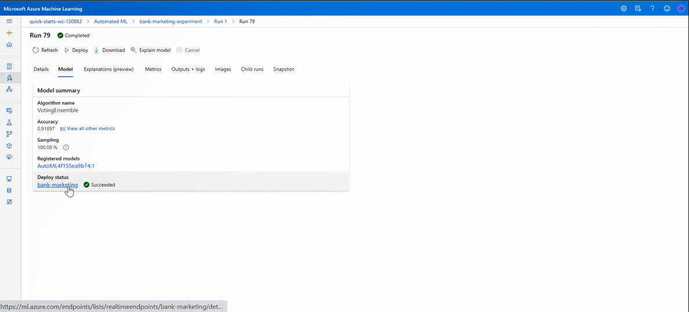

# Operationalizing Machine Learning

# Table of Contents
1. [Overview]()
2. [Summary]()
3. [Project Architecture]()
4. [Key Steps]()
5. [Screen Recording]()
6. [Standout Suggestions]()
7. [Future Work]()

## Overview
This project is part of the Udacity Azure ML Nanodegree. There are two facets to this project. First, we will build a codeless configuration of a closed-based machine learning production model, deploy and consume it using AUTOML. Second, we will build an Azure ML pipeline using the Python SDK to achieve the same goal of creating, deploying (publishing) and consuming a production model. In this repo, the Python SDK codes is resident in "bank-marketing-automl-deployment(main).ipynb" notebook file. These two facets of the project, explores the Azure ML End-to-End solution platform for enabling other web services to interact with the deployed model.  

## Summary
The data for use in this project is the UCI Bank Marketing dataset on client responses acquired through a direct call marketing campaign by a Portuguese banking Institution with the aim to access whether a client would subscribe for the bank term deposit given as a ‘yes’, or a ‘no’. Therefore, the problem suggests a binary classification problem where the goal is to predict if the client will subscribe a term deposit. The data can be found: 

* [Online](https://automlsamplenotebookdata.blob.core.windows.net/automl-sample-notebook-data/bankmarketing_train.csv")

* [Local File](bankmarketing_train.csv)

For this classification task of predicting whether a user will subscribe, which will either be a ‘yes’ or a ‘no’, the Voting Ensemble model emerged as the best performing model and serves as the production model which is deployed and consumed for client-side consumption.

## Project Architecture
This project architecture is diagrammatically shown below.

The individual steps to the realization of the Azure ML End-to-End solution deployment platform comprises of the following.
 
 1. Authentication
 2. Upload and Register Dataset
 3. Automated ML Experiment
 4. Deploy the best model
 5. Enable logging
 6. Swagger Documentation
 7. Consume model endpoints
 8. Create and publish a pipeline
 9. Documentation

These steps will be described subsequently, though with the exclusion of the Authentication and Documentation steps. The Authentication step is basically for creating a service principle which will enable role-based access control for exploring Azure resources, but the project is currently using the Udacity provided access. For the Documentation, this “ReadMe file” provides the details of this project’s Azure ML pipeline execution process.
 

## Key Steps

### Step 1: Upload and Register the Bank Marketing Dataset to Workspace. 

Click Datasets >> from local files >> Enter dataset details >> Click Browse to upload the “bankmarketing_train.csv dataset >> Select “Use header from the first file” >> Create dataset in Azure data store. Once successful the registered dataset will be resident in the workspaceblobstore as shown below.

### Step 2: Create a New Automated ML Experiment. 

The Automated ML (AutoML) run, once initiated, trains the Bank Marketing dataset using various machine learning algorithms and also tunes the model’s hyper-parameters for best performance. To achieve Auto ML:

Click “Automated ML” >> New Auto ML run >> Select dataset >> Enter Experiment name >> Select the Outcome variable >> Configure or Select Compute Cluster >> Select ML Task. In our case, the task selected is classification since the outcome variable of “yes” or “no” values.  Auto ML run usually takes about 30 minutes to 1 hour to complete, but once completed the experiment status changes from Running to Completed as shown in the below image.

### Step 3: Select the best model. 

Click Run ID >> Model to view all model runs. Typically, the top-most of the list is the best performing model of which the Voting Ensemble model emerged as the best performing of Auto ML run with a 92% accuracy as can be seen in the below image. 

### Step 4: Deploy the Best Model. 

A deployed model interacts with a production environment via HTTP API service in order to receive input via a POST request and return the model’s predicted output. To deploy the best model:

Click the “Voting Ensemble model” >> navigate to “deploy” button and click >> Enter Model Deployment name >> Select compute type >> Enable Authentication >> Click Deploy. We chose the Azure Container Instance (ACI) as the compute type and enabled key-based authentication. Once deployed, the status will show succeeded as given below.

### Step 5: Enable logging. 

The logging feature of the Azure diagnostic tool, which logs anomalies and errors, makes debugging a web service application easy. The performance logs can be visualized by enabling “Application Insights” during deployment. There are two ways to achieve this: by enabling it from deployment settings of the Azure studio, or through a script. In this repo, the script is the Logs.py.  See the below images.

The enabled “Application Insights” from the deployed model endpoint.

A successfully generated logs from the deployed model endpoint.

### Step 6: Swagger Documentation. 
Azure ML has support for Swagger, a tool that makes it easy for internal and external services to interact with the HTTP API of a deployed model for back-end implementation and client-side consumption. In this repo, the swagger documentation is saved in a folder called “Swagger”. We show our production model HTTP API request and response methods on swagger as follows.

### Step 7: Consume model endpoints. 

Once the model endpoint is consumed it provides us the privilege to establish internal and external services interactions such as request and response to the HTTP API. Here are: 

We created a JSON request Script, endpoint.py that is in this repo, which has two data points that represents bank customers who will either subscribe to the bank loan or not. From the “Model Response” as shown in the below image, the model outputs a “Yes” to the subscription for the first customer and a “No” for the second customer.  

For measuring the model’s performance, we used a simple Apache command line which can be found in the “Benchmark.sh” file in this repo to test the interaction calls to the HTTP API. The data.json file is created as the endpoint.py file executed; then the key and scoring uri was gotten from the consumed model. A generated log of our production model’s performance with the benchmark file is shown in the below image as follows.

### Step 8: Create and publish a pipeline. 

The Azure ML pipeline offers a coding possibility for an End-to-End Machine Learning pipeline using the Python SDK. The processes are summarized:

#### Create a Pipeline
Using the Python SDK, an Auto ML pipeline is created. Once created a “Run ID” will be generated with a “completed’ status as shown below. 

To view the pipeline endpoint, navigate to the Endpoints >> Pipeline endpoints as shown below.

As visualized from the Auto ML module with the Bank Marketing dataset, the Python SDK ML pipeline run also outputted the “Voting Ensemble” as the best model with a 92% accuracy as well.

#### Publish the Pipeline

Once created, the published pipeline will show an Active status and a rest endpoint. To view >> Pipeline >> Click the pipeline Run ID. As can be visualized from the below image, our published pipeline overview shows an active status and a REST endpoint.

We can also re-run the ML pipeline in the Python SDK and show run using the “RunDetails Widget” as follows. 

To view the pipeline re-run on the Azure Studio, navigate to the Endpoints >> Click on the newly created Pipeline >> Pipeline endpoints. This will show a running status as follows. 

## Screen Recording
For a demonstration of the capabilities of Azure ML Studio for the development of End-to-End ML production model, click the provided link to a screencast recording of the project. 

 

## Standout Suggestions

There are two standout modifications made: 

   • First: We replicated the default profiler in Azure ML studio, which generates profiles of registered dataset, by exploring the Pandas profiling functionality. Provided 
    below is a view of the correlation table generated between all variables in the dataset. 

  

    • In order to explore the importance of features that contributed to the success of the best prediction model within the Azure ML Python SDK, the model expandability     
    parameter was set to True in the AUTOML configuration settings. Even though this was not successful, here we show a view of the top four features that contributed to the     best model performance.
    

 
 
 
 ## Future work

The following are the performance improvement strategies that can be explored to increase performance. They are:

- Having noted the top-most performing models, we can focus on creating a Hyperdrive run for tunning the hyper-parameters of the top-best models using a Grid search or   
   random search strategy. 
     
- A better metric such as AUC metric or the F1 metric can be used to evaluate performance because they are insensitive to class imbalance. 
   
- Class balancing techniques such as up-sampling the smaller class, ‘no’, or down-sampling the larger class, ‘yes’; these methods can help to prevent overfitting. 
   
- For the Azure Python SDK AutoML run, the cross-validation hyperparameter can be experimented to find the best cross-validation fold for the given data.

    
    
